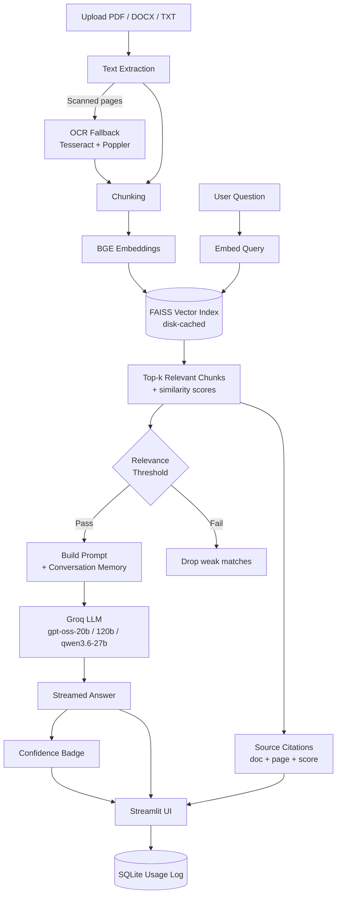

# 📚 RAG PDF Q&A

Ask questions and get **cited answers** straight from your own documents — powered by **FAISS** vector search, **BGE embeddings**, and **Groq** for blazing-fast inference.


---

## ✨ What's New in This Version

- **Multi-document support** — upload several PDFs/DOCX/TXT files at once, toggle which ones are active for a given question.
- **Source citations** — every answer shows which document (and page, for PDFs) each retrieved chunk came from, plus a similarity score.
- **Confidence badge** — a High/Medium/Low indicator based on the top retrieval score, shown before the answer.
- **Streaming answers** — responses stream token-by-token instead of appearing all at once.
- **Conversation memory** — recent turns are included in the prompt so follow-up questions work (*"what about the second one?"*).
- **Relevance threshold** — a sidebar slider drops weak matches instead of always forcing in `k` chunks.
- **OCR fallback** — scanned/image-only PDF pages are run through Tesseract if `pytesseract` + `poppler` are available; otherwise they're skipped with a warning instead of crashing.
- **DOCX / TXT support** in addition to PDF.
- **Disk-cached indexes** — re-uploading the same file skips re-embedding.
- **Model picker** — choose between Groq's current production models (`gpt-oss-20b`, `gpt-oss-120b`, `qwen3.6-27b`).
- **Downloadable transcript** and a usage log (SQLite) of recent questions, latency, and top retrieval score.
- **`eval.py`** — a small CLI script to sanity-check retrieval accuracy against a JSON test set whenever you change chunking/embeddings/k.

---

## 🧠 How It Works



**Pipeline summary:**
1. Documents are parsed and split into chunks (with OCR fallback for scanned pages).
2. Chunks are embedded with **BGE** and stored in a **FAISS** index, cached to disk so repeat uploads are instant.
3. A question is embedded the same way, and the most relevant chunks are retrieved and filtered by a relevance threshold.
4. Retrieved chunks + recent conversation history are sent to a **Groq**-hosted LLM, which streams back an answer.
5. The UI shows the answer alongside its **confidence badge** and **source citations** (document, page, similarity score).

---

## 🗂 Project Layout

```
.
├── app.py              # Streamlit UI
├── rag_core.py         # extraction, chunking, indexing, retrieval, Groq calls, logging
├── eval.py             # retrieval accuracy eval script
├── requirements.txt
├── Dockerfile
└── .env.example
```

---

## 🚀 Getting Started

### 1. Clone the repository

```bash
git clone https://github.com/<your-username>/rag-pdf-qa.git
cd rag-pdf-qa
```

### 2. Set up your environment

Copy the example env file and add your Groq API key:

```bash
cp .env.example .env
# then open .env and set GROQ_API_KEY=your_key_here
```

### 3. Install & run — by OS

<details>
<summary><strong>🪟 Windows (PowerShell / CMD)</strong></summary>

```powershell
python -m venv venv
venv\Scripts\activate
pip install -r requirements.txt
copy .env.example .env
streamlit run app.py
```

</details>

<details>
<summary><strong>🍎 macOS</strong></summary>

```bash
python3 -m venv venv
source venv/bin/activate
pip install -r requirements.txt
cp .env.example .env
streamlit run app.py
```

</details>

<details>
<summary><strong>🐧 Ubuntu / Debian Linux</strong></summary>

```bash
sudo apt-get update
sudo apt-get install -y python3-venv python3-pip
python3 -m venv venv
source venv/bin/activate
pip install -r requirements.txt
cp .env.example .env
streamlit run app.py
```

</details>

The app will be available at **http://localhost:8501**.

---

## 🔍 OCR Fallback (Optional)

For scanned/image-only PDF pages, install the system binaries needed by `pytesseract` and `pdf2image`:

<details>
<summary><strong>🐧 Ubuntu / Debian</strong></summary>

```bash
sudo apt-get install tesseract-ocr poppler-utils
```

</details>

<details>
<summary><strong>🍎 macOS (Homebrew)</strong></summary>

```bash
brew install tesseract poppler
```

</details>

<details>
<summary><strong>🪟 Windows</strong></summary>

1. Install [Tesseract OCR](https://github.com/UB-Mannheim/tesseract/wiki) and add it to your `PATH`.
2. Install [Poppler for Windows](https://github.com/oschwartz10612/poppler-windows/releases/) and add its `bin/` folder to your `PATH`.

</details>

> If these aren't installed, the app still works — scanned pages just won't produce text, and the sidebar shows a warning instead of crashing.

---

## 🐳 Run with Docker

```bash
docker build -t rag-pdf-qa .
docker run -p 8501:8501 --env-file .env rag-pdf-qa
```

---

## ✅ Evaluating Retrieval

Use `eval.py` to sanity-check retrieval accuracy whenever you change chunking, embeddings, or `k`:

```bash
python eval.py --pdf sample.pdf --testset testset.json
```

**`testset.json` format:**

```json
[
  {"question": "What is the context window?", "expect_contains": "context window"}
]
```

---

## 🛠 Tech Stack

| Layer | Tool |
|---|---|
| UI | Streamlit |
| Embeddings | BGE (BAAI General Embeddings) |
| Vector Store | FAISS |
| LLM Inference | Groq (`gpt-oss-20b`, `gpt-oss-120b`, `qwen3.6-27b`) |
| OCR | Tesseract + Poppler (optional) |
| Logging | SQLite |

---

## 📄 License

This project is licensed under the [MIT License](LICENSE).

---

## 🙌 Contributing

Issues and PRs are welcome! If you spot a bug or have an idea for a new feature, feel free to open an issue.